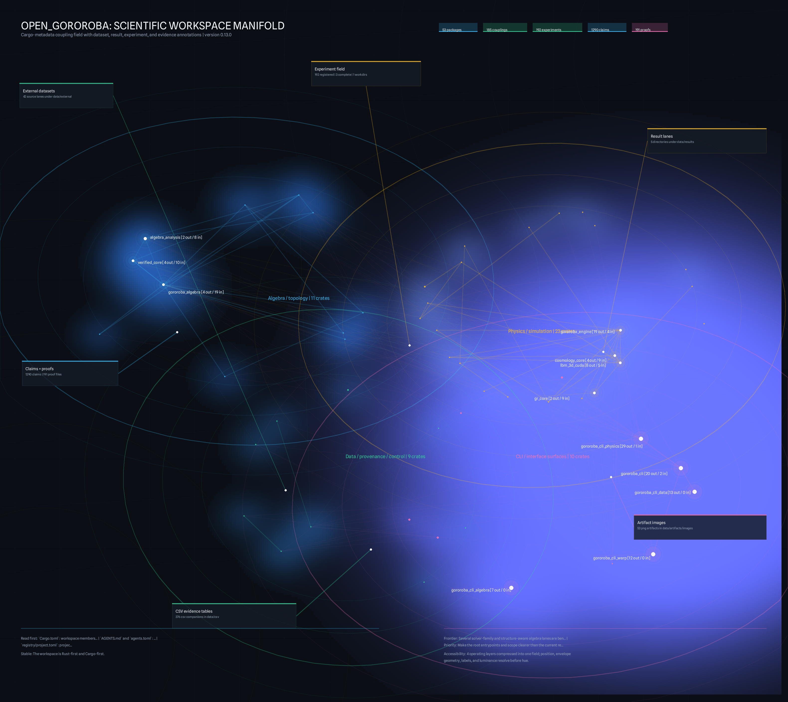
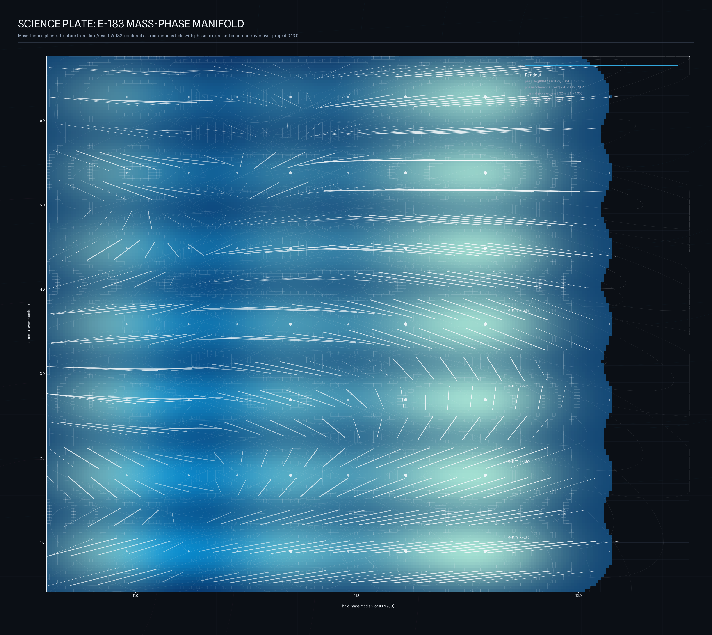

<!-- AUTO-GENERATED: DO NOT EDIT -->
<!-- Source of truth: registry/entrypoint_docs.toml -->

# open_gororoba

`open_gororoba` is a large Rust-first scientific research workspace, not a
single-purpose solver crate.

The repository currently combines four major operating layers:

1. Algebra and spectral analysis for Cayley-Dickson / obstruction / Jacobi work.
2. Physics and simulation crates for cosmology, GR, materials, optics, QGP,
   transport, and lattice-Boltzmann workflows.
3. Data, provenance, and registry infrastructure for evidence-first,
   reproducible research operations.
4. CLI, reporting, and publication surfaces that turn experiments, claims, and
   artifacts into reproducible outputs.

## What is stable today

- The workspace is Rust-first and Cargo-first.
- The TOML registry layer under `registry/` is the canonical control plane.
- The repo already has active crate families for algebra, physics, data
  governance, and CLI orchestration.
- The algebra precision lane now has explicit separation between
  production-safe paths and benchmark-only exploratory paths.

## What is still exploratory

- Several solver-family and structure-aware algebra lanes are benchmark-backed
  prototypes, not default production paths.
- Some GPU and CUDA paths remain partially integrated or optimization-oriented
  rather than fully closed as end-to-end validated defaults.
- Publication, mirror freshness, and final gate acceptance remain active
  governance work rather than finished cleanup.

## Where to look first

- `Cargo.toml`: workspace members and shared dependency policy.
- `AGENTS.md` and `agents.toml`: contributor operating policy.
- `registry/project.toml`: project metadata, sprint summaries, and counts.
- `registry/roadmap.toml`: active and completed workstreams.
- `registry/next_actions.toml`: the remaining explicit near-term actions.
- `reports/repo_scope_reset_2026_03_12.toml`: current repo-level scope reset.

## Current repo-level priorities

1. Make the root entrypoints and scope clearer than the current report sprawl.
2. Finish required-gate stabilization and final acceptance evidence.
3. Keep production-safe lanes clearly separated from benchmark-only prototypes.
4. Continue high-value subsystem work only after its repo-facing contract is
   clear, especially in the algebra precision lane.

## Repo visual map



Generated companions:

- `data/artifacts/images/repo_crate_family_map_3160x2820.png`
- `data/artifacts/images/repo_operator_matrix_3160x2820.png`
- `data/csv/repo_scope_summary.csv`
- `data/csv/repo_crate_families.csv`
- `data/csv/repo_operator_matrix.csv`

Regenerate the repo-facing visuals with:

```bash
cargo run -p gororoba_cli_data --bin repo-visuals
```

## Scientific plates



Generated companions:

- `data/artifacts/images/science_gravastar_stability_plate_3160x2820.png`
- `data/artifacts/images/science_pathion_zero_divisor_interaction_graph_3160x2820.png`

These science-facing plates are emitted from live generated result lanes:

- `data/results/e183/*` for the MaNGA mass-phase field and cross-algebra correlation analysis.
- `data/csv/gravastar_radial_stability.csv`, `data/csv/gravastar_ligo_mass_sweep.csv`, and `data/csv/genesis_gravastar_bridge.csv` for the radial instability field and stable branch distribution.
- `data/csv/pathion_zd_edges.csv` and `data/csv/sedenion_zd_edges.csv` for the zero-divisor interaction graphs.
- `data/csv/sedenion_mass_spectrum.csv`, `data/csv/pathion_coupling_sweep.csv`, `data/csv/pathion_sink_compare.csv`, and `data/csv/sedenion_field_metrics_3D.csv` for the mass spectrum, coupling response, damping trajectory, and 3D field relaxation summaries.

## Quickstart

```bash
make check
make rust-regression
make doctor
cargo test -p algebra_analysis --lib
cargo test -p gororoba_cli_algebra --bin structured-spectrum-bench
make docs-site
make docs-gate
make docs-redirect-check
make docs-freshness
```

`make docs-site` builds the unified docs bundle into `target/site-docs`
(mdBook + rustdoc).
`make docs-gate` is the same staged bundle used by CI for publication.
`make docs-redirect-check` validates shortlinks and legacy path redirect
artifacts.
`make docs-freshness` runs the same docs staging checks as CI freshness
verification.
Set repository Pages source to **GitHub Actions** to have `main` pushes
auto-publish the bundle from CI.
Shortlinks are also available at `/book` and `/rustdoc`, and legacy local paths
containing `.cache/.../doc/...` will be redirected to the `rustdoc` path by the
hosted 404 fallback.
For fuller install and reproducibility guidance, see `docs/REQUIREMENTS.md`
and `registry/requirements_narrative.toml`.
